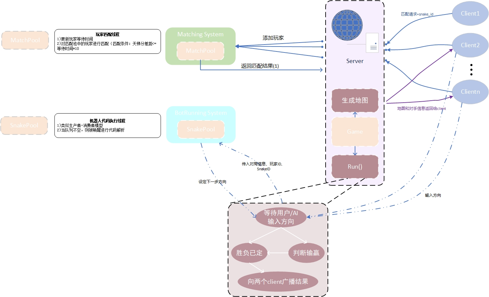
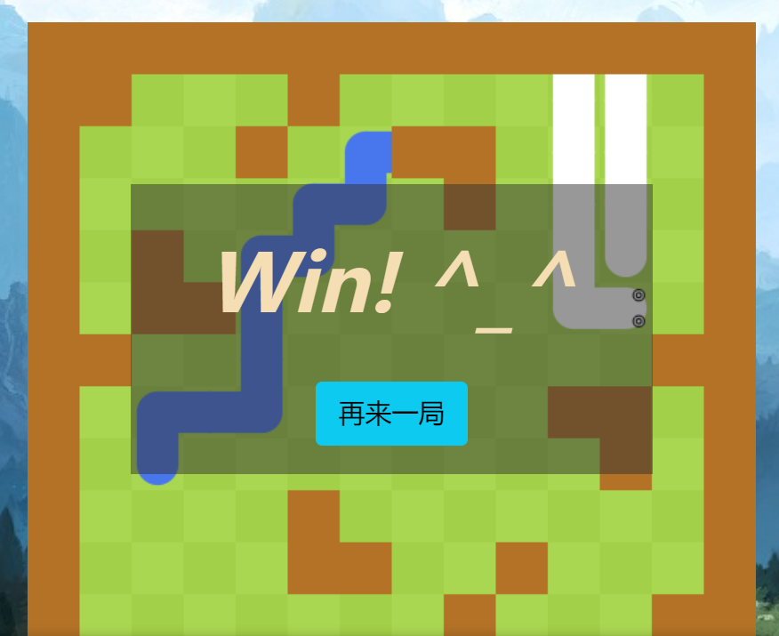

# Angry Snake

> SpringBoot + MyBatis-Plus + MySql + JavaScript


### 游戏介绍

一款可以与玩家/AI **实时对战的回合制游戏**，采用**前后端分离**实现，在每回合你可以控制你的snake朝着某个方向进行下一步移动来打败对方的snake！

游戏判决规则：

- 对方蛇撞墙 或者 撞到了你的蛇 或者 撞到了自己  ===> You Win!
- 两条蛇同时相撞 ===>  Dogfall


### MyBatis-Plus

一个 [MyBatis (opens new window)](https://www.mybatis.org/mybatis-3/)的增强工具，在 MyBatis 的基础上只做增强不做改变，为简化开发、提高效率而生。有着无侵入、损耗小、内置代码生成器等优势。

> 用MyBatis-Plus 完成 SpringBoot 对接 Mysql 数据库


### JSON Web Token(JWT)

定义了一种紧凑的、自包含的方式，用于作为JSON对象在各方之间安全地传输信息。该信息可以被验证和信任，因为它是数字签名的。

> 由于前后端分离，前端和后端会有跨域的问题，因此用JWT验证会更容易一些。


### Docker

优点：方便项目迁移，如果想要更换服务商，直接导出镜像


## 用户登录

数据库表 user表设计：

|  id  | username | password |   photo    |
| :--: | :------: | :------: | :--------: |
|  1   |   fish   |  xxxxxx  | 存的是链接 |

后端相关API：

- /user/account/token/：验证用户名密码，验证成功后返回jwt token（令牌）
- /user/account/info/：根据令牌返回用户信息
- /user/account/register/：注册账号

>  退出登录：直接在前端删除 token 即可


**用户登录持久化**：

将token存储在浏览器的localStorage里

```js
localStorage.setItem("jwt_token", resp.token);
```

浏览器刷新进入到登录页面时：

- 如果已经登录了
  - 获取浏览器里存储的token
  - 更新token
  - 利用token从云端获取信息
    - 成功：跳转至首页


## 项目架构

### 对战匹配

- 用户从浏览器Client 点击开始匹配 / 取消匹配，后端Websocket 接收到前端消息后触发 onMessage()
  - 开始匹配 ==> startMatching
  - 取消匹配 ==> stopMatching
- 后端 Server 发送post请求(`restTemplate.postForObject(addPlayerUrl,data,String.class)`) 至 匹配微服务系统。(data为用户信息：userID,rating)
- 微服务系统解析data，然后将用户加入用户匹配池中。
- 匹配池中单独开一个线程用于用户匹配
  - 每间隔1s进行一次检查匹配
  - 如果两个用户匹配成功 再通过`restTemplate.postForObject(startGameUrl,data,String.class)`发送开始游戏请求给Server后端。
- Server后端收到匹配微服务系统的匹配结果后开始准备一场游戏
  - 建立地图
  - 将地图、对手信息分别传给Client浏览器



### 代码执行微服务

利用joor-java-8动态编译执行java代码


在未来是可以换成任意语言的，可以在云端替换成 Docker ，设定一个内存上限及执行时间去执行一段代码。

> 如何启动一个docker，并启动一个命令。


## 报错/警告 解决

- SpringBoot启动时出现：java.io.IOException: The server sockets created using the LocalRMIServerSocketFactor

  > 方法1：在VM options里添加：-Dcom.sun.management.jmxremote.local.only=false
  >
  > 方法2：在自己的jdk所在文件夹中搜索找到management.properties这个文件
  > 在文件中找到85行：com.sun.management.jmxremote.local.only=false ， 取消该行注释


## Bug记录



好像地图向上偏移了一个单位。。。。


## TODO

1. 个人中心界面修改Snake信息时，输入修改信息后点击“取消” 会将当前显示的Snake信息覆盖 【已解决】

   > 设置一个 copy_snakes数组存储修改前的信息，如果取消修改，则将对应的snake还原
   
2. 添加“对战聊天”功能

   - 前端
   - 后端

3. 添加“强化AI”对战

   - 强化学习 TD3训练AI
   - 前端
   - 后端

4. 添加背景音乐或者游戏音效