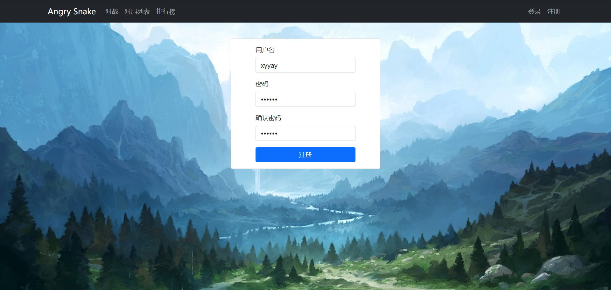

# Angry Snake

> SpringBoot + MyBatis-Plus + MySql + JavaScript


### 游戏介绍

一款可以与玩家/AI **实时对战的回合制游戏**，采用**前后端分离**实现，在每回合你可以控制你的snake朝着某个方向进行下一步移动来打败对方的snake！

游戏判决规则：

- 对方蛇撞墙 或者 撞到了你的蛇 或者 撞到了自己  ===> You Win!
- 两条蛇同时相撞 ===>  Dogfall

#### 注册及登录界面展示



#### 匹配界面展示


#### 游戏界面展示


#### 排行榜


>  如果想要方便迁移，可以部署到Docker容器中方便迁移，直接备份docker即可。


#### 后端

- springboot
- mysql
- mybatis-plus


#### 前端

- vue3： 最终打包成一个html文件和一些css、js文件


> 前后端分离：后端只将前端需要展示的数据传送过来，前端动态地将数据渲染在页面中


### MyBatis-Plus

一个 [MyBatis (opens new window)](https://www.mybatis.org/mybatis-3/)的增强工具，在 MyBatis 的基础上只做增强不做改变，为简化开发、提高效率而生。有着无侵入、损耗小、内置代码生成器等优势。

> 用MyBatis-Plus 完成 SpringBoot 对接 Mysql 数据库


### JSON Web Token(JWT)

定义了一种紧凑的、自包含的方式，用于作为JSON对象在各方之间安全地传输信息。该信息可以被验证和信任，因为它是数字签名的。

> 由于前后端分离，前端和后端会有跨域的问题，因此用JWT验证会更容易一些。


### Docker

优点：方便项目迁移，如果想要更换服务商，直接导出镜像

> docker load -i docker_namexxx.tar
>
> docker run -p 20000:22 -p 443:443 -p 80:80 -p 6969 :6969 -p 3000:3000-p 3002:3002 -itd --name kob_server diango_lesson:1.0
>
> - 443为https的端口
> - 80为http端口
> - 6969 3002 3000分别为三个微服务的端口 
>
> docker attach kob_server   进入容器

一些其他命令：

```
镜像（images）
docker pull ubuntu:20.04：拉取一个镜像
docker images：列出本地所有镜像
docker image rm ubuntu:20.04 或 docker rmi ubuntu:20.04：删除镜像ubuntu:20.04
docker [container] commit CONTAINER IMAGE_NAME:TAG：创建某个container的镜像
docker save -o ubuntu_20_04.tar ubuntu:20.04：将镜像ubuntu:20.04导出到本地文件ubuntu_20_04.tar中
docker load -i ubuntu_20_04.tar：将镜像ubuntu:20.04从本地文件ubuntu_20_04.tar中加载出来

容器(container)
docker [container] create -it ubuntu:20.04：利用镜像ubuntu:20.04创建一个容器。
docker ps -a：查看本地的所有容器
docker [container] start CONTAINER：启动容器
docker [container] stop CONTAINER：停止容器
docker [container] restart CONTAINER：重启容器
docker [contaienr] run -itd ubuntu:20.04：创建并启动一个容器
docker [container] attach CONTAINER：进入容器
先按Ctrl-p，再按Ctrl-q可以挂起容器
docker [container] exec CONTAINER COMMAND：在容器中执行命令
docker [container] rm CONTAINER：删除容器
docker container prune：删除所有已停止的容器
docker export -o xxx.tar CONTAINER：将容器CONTAINER导出到本地文件xxx.tar中
docker import xxx.tar image_name:tag：将本地文件xxx.tar导入成镜像，并将镜像命名为image_name:tag
docker export/import与docker save/load的区别：
export/import会丢弃历史记录和元数据信息，仅保存容器当时的快照状态
save/load会保存完整记录，体积更大
docker top CONTAINER：查看某个容器内的所有进程
docker stats：查看所有容器的统计信息，包括CPU、内存、存储、网络等信息
docker cp xxx CONTAINER:xxx 或 docker cp CONTAINER:xxx xxx：在本地和容器间复制文件
docker rename CONTAINER1 CONTAINER2：重命名容器
docker update CONTAINER --memory 500MB：修改容器限制
```


> 注意：如果运行容器报错某些端口被占用，可以使用 `sudo netstat -nlptu | grep xxx` 查看某个端口号是否被占用

> 注意：挂载容器一定要用Ctrl + p/q

## 数据库表设计

数据库表 user表设计：

|  id  | username | password |   photo    |
| :--: | :------: | :------: | :--------: |
|  1   |   fish   |  xxxxxx  | 存的是链接 |

后端相关API：

- /user/account/token/：验证用户名密码，验证成功后返回jwt token（令牌）
- /user/account/info/：根据令牌返回用户信息
- /user/account/register/：注册账号

>  退出登录：直接在前端删除 token 即可

**用户登录持久化**：

将token存储在浏览器的localStorage里

```js
localStorage.setItem("jwt_token", resp.token);
```

浏览器刷新进入到登录页面时：

- 如果已经登录了
  - 获取浏览器里存储的token
  - 更新token
  - 利用token从云端获取信息
    - 成功：跳转至首页

数据库表 snake 表设计：

| id   | user_id | title | description | content      | createtime | modifytime |
| ---- | ------- | ----- | ----------- | ------------ | ---------- | ---------- |
| 1    | 用户id  | 名称  | 描述        | 内容（代码） | 创建时间   | 修改时间   |

数据库表 record 表设计：

| id   | a_id    | a_sx       | a_sy       | b_id    | b_sx       | b_sy       | a_steps | b_steps | map      | loser | createtime |
| ---- | ------- | ---------- | ---------- | ------- | ---------- | ---------- | ------- | ------- | -------- | ----- | ---------- |
| 1    | 选手1id | 选手1其实x | 选手1起始y | 选手2id | 选手2其实x | 选手2起始y | 步数    | 步数    | 地图信息 | 败方  | 创建时间   |


## 项目架构

### 对战匹配

- 用户从浏览器Client 点击开始匹配 / 取消匹配，后端Websocket 接收到前端消息后触发 onMessage()
  - 开始匹配 ==> startMatching
  - 取消匹配 ==> stopMatching
- 后端 Server 发送post请求(`restTemplate.postForObject(addPlayerUrl,data,String.class)`) 至 匹配微服务系统。(data为用户信息：userID,rating)
- 微服务系统解析data，然后将用户加入用户匹配池中。
- 匹配池中单独开一个线程用于用户匹配
  - 每间隔 1s 进行一次检查匹配
  - 如果两个用户匹配成功 再通过`restTemplate.postForObject(startGameUrl,data,String.class)`发送开始游戏请求给Server后端。
  - 匹配算法：
    - 两者天梯分数 <= 等待时间 * 10
- Server后端收到匹配微服务系统的匹配结果后开始准备一场游戏
  - 建立地图
  - 将地图、对手信息分别传给Client浏览器


### 代码执行微服务

利用joor-java-8动态编译执行java代码


在未来是可以换成任意语言的，可以在云端替换成 Docker ，设定一个内存上限及执行时间去执行一段代码。

> 如何启动一个docker，并启动一个命令。


## 报错/警告 解决

- SpringBoot启动时出现：java.io.IOException: The server sockets created using the LocalRMIServerSocketFactor

  > 方法1：在VM options里添加：-Dcom.sun.management.jmxremote.local.only=false
  >
  > 方法2：在自己的jdk所在文件夹中搜索找到management.properties这个文件
  > 在文件中找到85行：com.sun.management.jmxremote.local.only=false ， 取消该行注释


## Bug记录


好像地图向上偏移了一个单位。。。。


## TODO

1. 个人中心界面修改Snake信息时，输入修改信息后点击“取消” 会将当前显示的Snake信息覆盖 【已解决】

   > 设置一个 copy_snakes数组存储修改前的信息，如果取消修改，则将对应的snake还原
   
2. 添加“对战聊天”功能

   - 前端
   - 后端

3. 添加“强化AI”对战

   - 强化学习 TD3训练AI
   - 前端
   - 后端

4. 添加背景音乐或者游戏音效


tmux：


